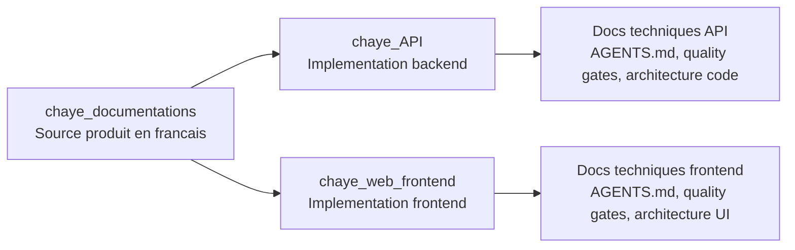
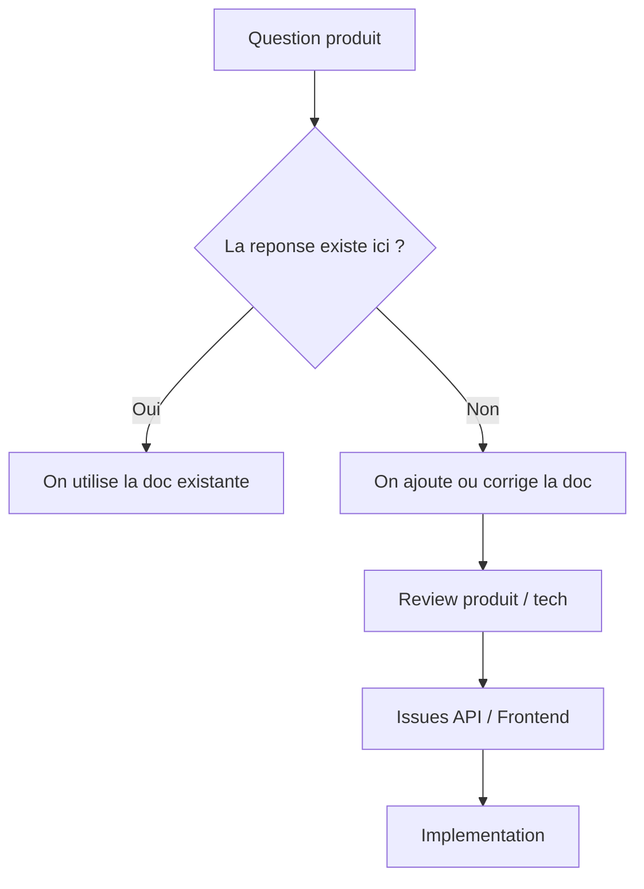
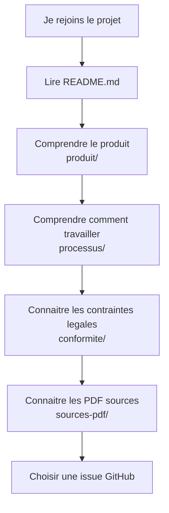
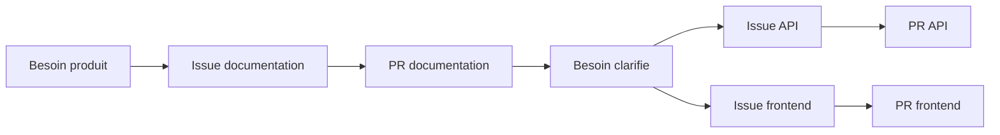
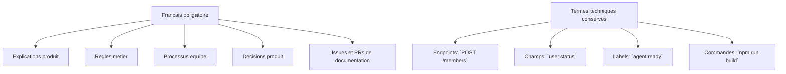
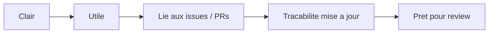

# Chaye Documentations

Ce repo est la documentation produit et organisationnelle de Chaye.

Il vit en **francais**. Les noms techniques restent en anglais quand ils correspondent a du code, des endpoints, des champs JSON, des labels GitHub ou des commandes.

Exemple:

```text
Un utilisateur suspendu ne peut pas appeler `POST /announcements`.
Le ticket porte le label `risk:legal`.
```

## A Quoi Sert Ce Repo ?

Ce repo sert a expliquer le produit avant de coder.

Il doit aider:

- un nouveau membre de l'equipe a comprendre Chaye;
- un dev a savoir quoi implementer;
- un reviewer a verifier si une PR respecte le besoin;
- un agent IA a travailler sans inventer les regles produit;
- l'equipe a garder une trace des decisions.



## Regle Simple

Avant de coder une fonctionnalite importante, la regle produit doit etre claire ici.

Si une question produit revient plusieurs fois, il faut l'ecrire ici.

Si une decision est prise en review ou en discussion, il faut la tracer ici.



## Ce Qui Va Dans Ce Repo

| Sujet | Emplacement |
| --- | --- |
| Vision produit | `produit/vision.md` |
| Glossaire | `produit/glossaire.md` |
| Parcours utilisateur | `produit/parcours-utilisateur.md` |
| Specification fonctionnelle | `produit/specification.md` |
| Backlog produit | `produit/backlog.md` |
| Tracabilite besoin -> issue -> PR | `produit/tracabilite.md` |
| Mentions legales, CGU, moderation | `conformite/` |
| Processus equipe et agentique | `processus/` |
| Contrats API valides cote produit | `contrats/` |
| Decisions structurantes | `decisions/` |
| Diagrammes explicatifs | `diagrammes/` |
| Documents PDF d'origine | `sources-pdf/` |

## Ce Qui Ne Va Pas Ici

Ce repo ne doit pas devenir un double du code.

Ne mets pas ici:

- les details d'installation propres a un seul repo technique;
- les commandes de test tres specifiques a l'API ou au frontend;
- les notes temporaires d'une branche;
- les gros extraits de code;
- les informations secretes;
- les fichiers `.env`;
- les mots de passe, tokens, cles API ou identifiants prives.

Ces informations restent dans:

- `chaye_API/AGENTS.md`;
- `chaye_API/docs/`;
- `chaye_web_frontend/AGENTS.md`;
- `chaye_web_frontend/docs/`.

## Comment Utiliser Ce Repo Quand Tu Rejoins Le Projet

Lis dans cet ordre:

1. `README.md`
2. `produit/README.md`
3. `produit/glossaire.md`
4. `produit/parcours-utilisateur.md`
5. `processus/onboarding-nouveau-dev.md`
6. `processus/issues-github.md`
7. `processus/travail-agentique.md`
8. `conformite/README.md`
9. `sources-pdf/README.md`



## Workflow Avec Les Issues GitHub

Les issues GitHub restent le lieu de pilotage du travail.

Ce repo sert a cadrer le besoin. Les repos `chaye_API` et `chaye_web_frontend` servent a implementer.



### Quand Creer Une Issue Dans Ce Repo ?

Cree une issue ici quand:

- une regle produit est floue;
- une decision doit etre discutee;
- une documentation manque;
- un parcours utilisateur doit etre decrit;
- une contrainte legale ou organisationnelle doit etre clarifiee;
- une specification doit etre mise a jour avant implementation.

### Quand Creer Une Issue Dans API Ou Frontend ?

Cree une issue dans `chaye_API` ou `chaye_web_frontend` quand:

- le besoin est assez clair pour etre implemente;
- les criteres d'acceptation sont compréhensibles;
- les impacts techniques sont identifies;
- le ticket peut etre code et teste.

## Regles De Langue

Le repo documentation vit en francais.



Mauvais:

```text
The suspended user cannot create an announcement.
```

Bon:

```text
L'utilisateur suspendu ne peut pas creer une annonce via `POST /announcements`.
```

## Toujours Ajouter Une Note Explicative

Quand tu ajoutes un nouveau dossier ou une nouvelle documentation structurante, ajoute une note pour expliquer:

- a quoi sert le document;
- qui doit le lire;
- quand le mettre a jour;
- quels repos ou issues sont concernes.

Exemple:

```text
Ce document decrit le parcours de signalement.
Il doit etre lu avant toute issue liee a la moderation.
Il doit etre mis a jour si le delai de traitement ou le statut des signalements change.
```

Cette regle evite les documents "morts" que personne ne sait utiliser.

## Definition D'Une Bonne Mise A Jour De Doc

Une PR de documentation est prete quand:

- elle est ecrite en francais clair;
- elle explique pourquoi le changement existe;
- elle ne duplique pas inutilement les repos techniques;
- elle relie le besoin aux issues ou PRs concernees;
- elle met a jour la tracabilite si le statut du besoin change;
- elle ajoute une note explicative si un nouveau document structurant est cree.



## Liens Avec Les Repos Techniques

| Repo | Role |
| --- | --- |
| `chaye_documentations` | Source produit et workflow transverse en francais |
| `chaye_API` | Implementation backend, docs techniques API, quality gates API |
| `chaye_web_frontend` | Implementation frontend, docs techniques frontend, quality gates frontend |

Si une information produit est dans un repo technique mais concerne toute l'equipe, elle doit etre deplacee ou resumee ici.

Si une information est purement technique et ne concerne qu'un repo, elle reste dans ce repo.
