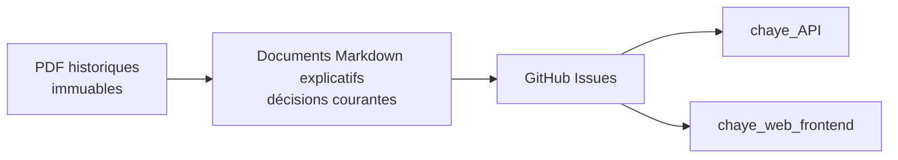
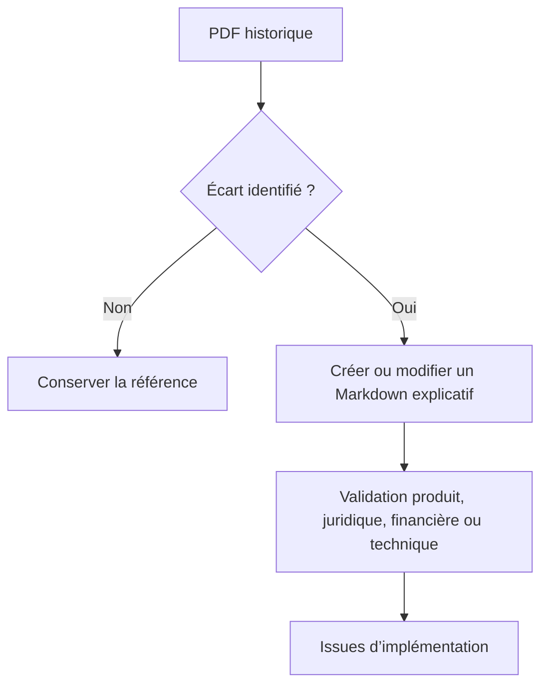

# Chaye Documentations

Ce dépôt rassemble la documentation produit et organisationnelle transverse de Chaye.

La documentation technique centrale est aussi organisée par fonction métier
dans `docs/functions/`, avec les vues d'architecture, d'infrastructure et de
sécurité sous `docs/`. Les inventaires `docs/generated/` sont reproductibles et
mis à jour uniquement par Pull Request, sans auto-merge.

Il est rédigé en français. Les termes techniques restent en anglais lorsqu’ils correspondent à du code, à un endpoint, à un champ, à une commande, à un label GitHub ou à un nom de fichier.

## Objectif

Ce dépôt permet :

- à un nouveau membre de comprendre le produit ;
- à l’équipe produit de formaliser ses décisions ;
- aux développeurs de savoir quel comportement implémenter ;
- aux reviewers de vérifier l’alignement d’une PR ;
- aux agents IA de travailler sans inventer de règle ;
- à l’équipe de conserver l’historique entre les PDF initiaux et les décisions plus récentes.

## Sources de vérité

| Sujet | Emplacement |
| --- | --- |
| PDF historiques initiaux | `sources-pdf/` |
| Audit des convergences et divergences | `produit/alignement-des-sources.md` |
| Vision, règles métier et parcours | `produit/` |
| Conformité, rôles et règles de confiance | `conformite/` |
| Processus d’équipe et agentiques | `processus/workflow-agentique.md` |
| Décisions structurantes | `decisions/` |
| Contrats fonctionnels transverses | `contrats/` |
| Diagrammes complémentaires | `diagrammes/` |
| Contrats HTTP publics | `../chaye_API/docs/openapi/openapi.yaml` |
| Backlog et statut du travail | GitHub Issues et PR |

## Règle concernant les PDF

Les PDF de `sources-pdf/` ne doivent jamais être modifiés, remplacés ou régénérés par un agent.

Ils représentent l’état historique initial du projet. Toute correction ou évolution fonctionnelle doit être ajoutée dans un Markdown explicatif qui :

1. cite le PDF et les pages concernés ;
2. décrit la divergence ;
3. indique la décision courante, si elle a été validée ;
4. mentionne les validations encore nécessaires ;
5. référence les issues ou PR d’implémentation.

## Parcours de lecture recommandé

1. `README.md`
2. `sources-pdf/README.md`
3. `produit/README.md`
4. `produit/alignement-des-sources.md`
5. `conformite/README.md`
6. `processus/README.md`
7. `processus/workflow-agentique.md`
8. l’issue GitHub liée au travail

## Ce qui ne doit pas être dupliqué ici

Ce dépôt ne doit pas contenir :

- les commandes d’installation propres à un seul dépôt technique ;
- les détails internes d’une implémentation locale ;
- une copie manuelle du contrat OpenAPI ;
- un backlog Markdown parallèle aux GitHub Issues ;
- des secrets, tokens, mots de passe ou fichiers `.env` ;
- une correction directe d’un PDF historique.

## Qualité rédactionnelle

Chaque document modifié doit être relu pour vérifier :

- les accents ;
- l’orthographe ;
- les accords ;
- la ponctuation ;
- la cohérence des termes ;
- la distinction entre fait, hypothèse, recommandation et décision validée.

Une formulation juridique ou financière non accompagnée d’une preuve doit rester présentée comme un point à valider.

## Liens avec les dépôts techniques

| Dépôt | Rôle |
| --- | --- |
| `chaye_documentations` | Produit, conformité et workflow transverse |
| `chaye_API` | Backend, OpenAPI et documentation technique API |
| `chaye_web_frontend` | Frontend et documentation technique frontend |

Une information transverse doit être expliquée ici. Une information purement technique reste dans le dépôt qui en est propriétaire.
