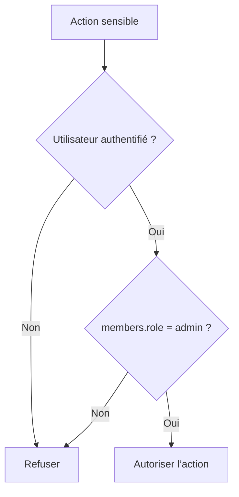

# Rôles et autorisations

Ce document explique comment Chaye distingue les utilisateurs classiques des administrateurs.

Il doit être lu avant toute issue liée :

- à un back-office ;
- à la modération ;
- à la suspension d’un compte ;
- aux signalements ;
- à une action réservée à l’équipe Chaye.

Il doit être mis à jour lorsqu’un rôle ou une règle d’autorisation change.

## Règle actuelle

Un administrateur doit être identifié par un état explicite, jamais par une donnée détournée telle qu’une adresse postale.

Côté API, la source technique actuelle est :

```text
members.role
```

| Valeur | Signification |
| --- | --- |
| `user` | Utilisateur standard |
| `admin` | Administrateur Chaye |

## Règle de sécurité

Une action d’administration ne doit jamais dépendre :

- de `members.address` ;
- d’un email codé en dur ;
- d’un nom ou d’un prénom ;
- d’une valeur modifiable par l’utilisateur.



## Impact produit

Cette règle est nécessaire avant de construire :

- le back-office de modération ;
- la liste des signalements ;
- les actions de suspension ;
- les décisions de médiation ;
- les outils internes de support.

Sans rôle explicite, une fonctionnalité d’administration est trop risquée pour une mise en production.

## Lien avec les PDF

Le cahier des charges mentionne des rôles `admin` et `super-admin` (`Chaye_CDC_V3.1_Final.pdf`, p. 9), tandis que le brief technique demande un back-office sans décrire précisément la hiérarchie des rôles (`Chaye_Brief_Technique.pdf`, p. 1).

La présence de `super-admin` reste donc à confirmer par une décision produit avant implémentation.
