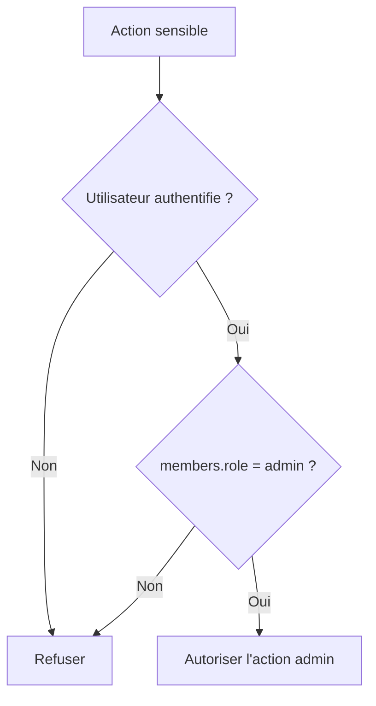

# Roles Et Autorisations

Ce document explique comment Chaye distingue les utilisateurs standards des administrateurs.

Il doit etre lu avant toute issue liee:

- a un back-office;
- a la moderation;
- a la suspension de compte;
- aux signalements;
- a une action reservee a l'equipe Chaye.

Il doit etre mis a jour si un nouveau role est ajoute ou si une regle d'autorisation change.

## Regle Actuelle

Un administrateur doit etre identifie par un etat explicite, pas par une donnee detournee comme une adresse postale.

Cote API, la source technique actuelle est:

```text
members.role
```

Valeurs connues:

| Valeur | Signification |
| --- | --- |
| `user` | Utilisateur standard |
| `admin` | Administrateur Chaye |

## Regle De Securite

Une action admin ne doit jamais dependre:

- de `members.address`;
- d'un email code en dur;
- d'un nom ou prenom;
- d'une valeur modifiable par l'utilisateur.



## Impact Produit

Cette regle est necessaire avant de construire:

- le back-office de moderation;
- la liste admin des signalements;
- les actions de suspension;
- les decisions de mediation;
- les outils internes de support.

Sans role explicite, une fonctionnalite admin est consideree trop risquee pour etre mise en production.
