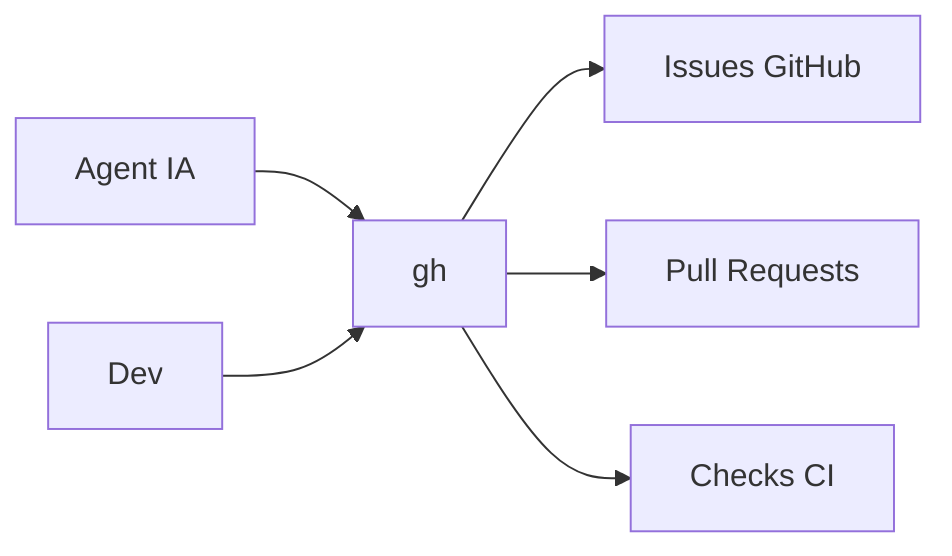

# GitHub CLI `gh`

Ce document explique comment utiliser le binaire `gh` dans le workflow Chaye.

Il doit etre lu par:

- les nouveaux devs;
- les agents IA;
- les reviewers qui suivent les issues et PRs;
- toute personne qui automatise la gestion GitHub.

Il doit etre mis a jour si la facon de gerer les issues, labels, milestones ou PRs change.

## Pourquoi `gh` Est Important

`gh` est l'outil en ligne de commande officiel pour interagir avec GitHub.

Dans Chaye, il sert a:

- lister les issues;
- creer des issues;
- verifier les doublons;
- creer ou mettre a jour des PRs;
- lire les checks GitHub;
- synchroniser le travail des agents IA avec l'equipe.

Les agents IA doivent privilegier `gh` quand ils doivent manipuler GitHub, car cela laisse des actions traçables et reproductibles.



## Installation

Verifier que `gh` est disponible:

```bash
gh --version
```

Si la commande n'existe pas, installer GitHub CLI depuis la documentation officielle ou via le gestionnaire de paquets de la machine.

## Authentification Obligatoire

Avant de travailler avec les issues ou les PRs, verifier l'authentification:

```bash
gh auth status
```

Si `gh` n'est pas authentifie, lancer:

```bash
gh auth login -h github.com
```

Choisir une authentification qui donne acces aux repos Chaye.

## Regle Pour Les Agents IA

Un agent IA doit utiliser `gh` pour les actions GitHub quand l'acces reseau et l'authentification sont disponibles.

Avant de creer une issue, l'agent doit verifier les doublons:

```bash
gh issue list --repo Chaye-parcel-traveler/chaye_API --state all --limit 100 --json number,title
gh issue list --repo Chaye-parcel-traveler/chaye_web_frontend --state all --limit 100 --json number,title
gh issue list --repo Chaye-parcel-traveler/chaye_documentations --state all --limit 100 --json number,title
```

Avant de conclure qu'une PR est prete, l'agent doit verifier les checks:

```bash
gh pr view <numero> --repo <owner>/<repo> --json statusCheckRollup
```

## Si `gh` N'Est Pas Authentifie

Si `gh auth status` echoue:

1. ne pas creer d'issue ou de PR par une autre methode non tracee;
2. indiquer clairement que `gh` n'est pas authentifie;
3. demander a un humain d'executer `gh auth login -h github.com`;
4. reprendre l'action apres authentification.

## Permissions

Certaines actions demandent plus que le droit `WRITE`.

Exemple:

- creer ou modifier des issues: souvent possible avec `WRITE`;
- creer ou modifier des PRs: souvent possible avec `WRITE`;
- activer la protection de branche: necessite generalement `ADMIN`.

Si `gh` retourne une erreur de permission, l'agent doit documenter le blocage et creer ou mettre a jour une issue pour action admin.
