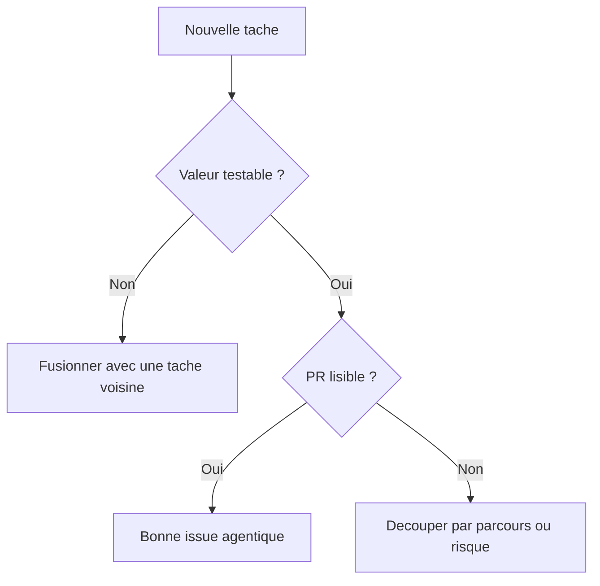

# Granularite Des Issues Agentiques

Ce document explique comment decouper les tickets pour les humains et les agents IA.

Il doit etre lu avant de creer, modifier ou synchroniser des issues GitHub.

Il doit etre mis a jour si l'equipe change sa facon de decouper le travail.

## Probleme A Eviter

Une issue trop petite cree beaucoup de bruit:

- trop de PRs;
- trop de reviews;
- trop de dependances entre tickets;
- trop de contexte a reconstruire;
- trop peu de valeur testable a chaque livraison.

Une issue trop grosse est aussi risquee:

- elle melange plusieurs decisions produit;
- elle touche trop de zones du code;
- elle devient difficile a tester;
- elle bloque plusieurs personnes en meme temps.

## Regle Principale

Une issue agentique doit produire une valeur verifiable de bout en bout.

Elle ne doit pas etre decoupee par fichier, table, composant ou commande.



## Mauvais Et Bon Decoupage

Mauvais decoupage:

```text
Ajouter une colonne `members.status`
Ajouter l'enum status
Ajouter les tests status
Mettre a jour la documentation status
```

Bon decoupage:

```text
[API-MEMBER-001] Ajouter le statut utilisateur

Inclus:
- migration `members.status`
- modele/factory/seeder
- tests associes
- documentation data/security/traceability

Exclu:
- endpoint admin de suspension
- blocage des actions transactionnelles
```

## Taille Cible

Une bonne issue agentique est souvent une issue `size:M`.

| Taille | Definition | Usage |
| --- | --- | --- |
| `size:S` | Correction locale et peu risquee | Bug simple, doc courte, ajustement isole |
| `size:M` | Changement coherent multi-fichiers avec test | Taille recommandee pour les agents |
| `size:L` | Plusieurs parcours, decisions ou risques | A rediscuter ou decouper avant implementation |

## Labels De Cadrage

| Label | Signification |
| --- | --- |
| `agent:ready` | L'issue est assez claire pour etre traitee. |
| `agent:needs-scope` | L'issue doit etre recadree avant implementation. |
| `agent:too-small` | L'issue est trop technique ou trop atomique; elle devrait etre fusionnee. |
| `agent:too-large` | L'issue melange trop de sujets; elle doit etre decoupee. |

## Format Recommande

Chaque issue agentique doit contenir:

```text
Objectif
Pourquoi ce travail existe.

Perimetre inclus
Ce que l'agent doit modifier.

Perimetre exclu
Ce que l'agent ne doit pas toucher.

Criteres d'acceptation
Comment savoir que c'est termine.

Fichiers probables
Pour guider sans enfermer.

Quality gates
Commandes a lancer.

Risques
Securite, juridique, donnees, UX.

Dependances
Issues ou decisions necessaires avant de commencer.
```

## Regle Pour Les Agents IA

Un agent ne doit pas creer automatiquement une issue par fichier, table, composant ou commande.

Avant de creer une issue, il doit se demander:

1. Est-ce que cette issue produit un comportement ou une decision verifiable ?
2. Est-ce que cette issue peut etre revue dans une PR lisible ?
3. Est-ce que les criteres d'acceptation prouvent vraiment la fin du travail ?
4. Est-ce que cette issue devrait etre fusionnee avec une issue voisine ?
5. Est-ce que cette issue devrait etre decoupee par parcours ou risque ?

## Exemples Chaye

Bon regroupement:

```text
[API-REPORT-001] Creer un signalement utilisateur

Inclus:
- table `reports`
- modele
- endpoint `POST /reports`
- validation
- tests
```

Ticket separe:

```text
[API-MOD-001] Moderer les signalements

Inclus:
- liste admin
- filtres
- SLA
- autorisation admin
```

Ces deux sujets doivent rester separes: creation d'un signalement et moderation admin ne sont pas le meme parcours.
