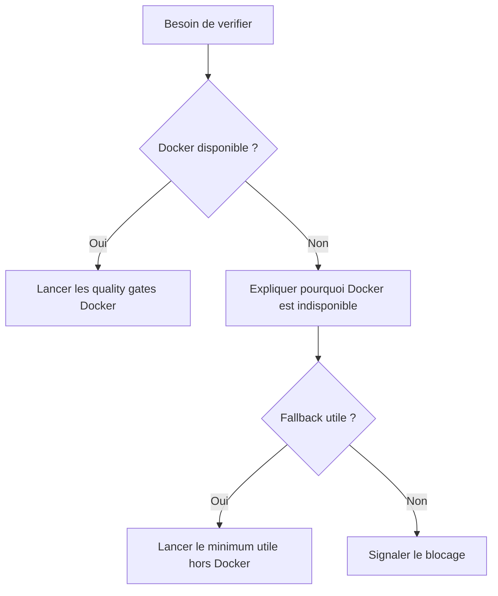

# Tests Docker First

Ce document explique la regle commune de validation pour les agents IA.

Il doit etre lu avant de lancer des tests, du lint, du typecheck ou un build.

Il doit etre mis a jour quand l'equipe change la strategie Docker d'un repo.

## Regle

Les agents doivent toujours essayer Docker en premier.

Les tests sur l'host ne sont pas le chemin nominal. Ils coutent du temps, reconstruisent parfois un environnement different de celui de l'equipe, et consomment des tokens sans garantir la reproductibilite.

## Comportement Attendu

Un agent doit:

- lire le fichier `AGENTS.md` du repo technique;
- lancer les commandes Docker documentees avant toute commande host;
- ne pas lancer les commandes host si Docker suffit a valider le changement;
- documenter clairement toute indisponibilite Docker;
- expliquer dans sa reponse finale si un fallback hors Docker a ete utilise.

## Repos Techniques

Les commandes exactes restent dans les repos techniques:

- `../chaye_API/AGENTS.md`
- `../chaye_API/docs/quality-gates.md`
- `../chaye_API/docs/docker-development.md`
- `../chaye_web_frontend/AGENTS.md`
- `../chaye_web_frontend/docs/quality-gates.md`
- `../chaye_web_frontend/docs/docker-development.md`

## Exceptions

Une commande host est acceptable seulement si:

- Docker est indisponible ou casse pour une raison d'infrastructure;
- la commande Docker ne couvre pas encore le type de verification demande;
- l'utilisateur demande explicitement une execution hors Docker.

Dans tous les cas, l'agent doit expliquer pourquoi Docker n'a pas ete suffisant.
