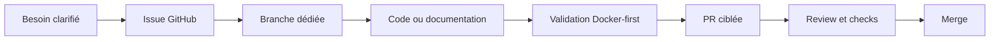
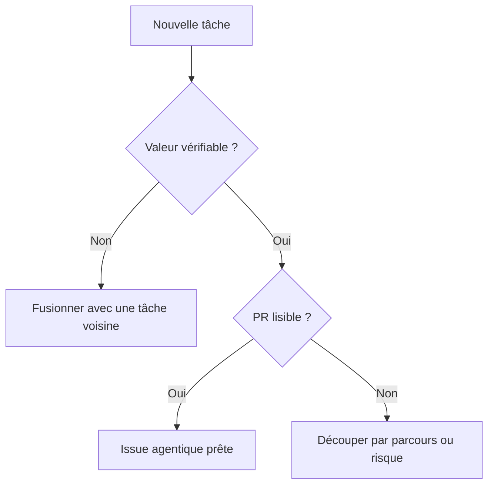
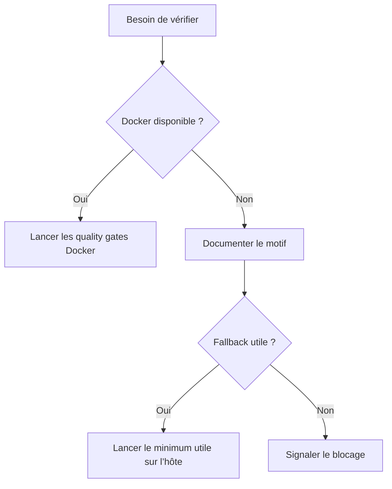

# Workflow agentique

Ce document regroupe les règles communes de travail avec les agents IA.

Il doit être lu avant de créer une issue, de commencer une implémentation, de lancer des tests ou d’ouvrir une PR.

Il doit être mis à jour lorsque l’équipe change ses conventions GitHub, ses quality gates ou sa manière de séparer code, documentation et gouvernance.

## Vue d’ensemble



## GitHub CLI

GitHub CLI `gh` est l’outil attendu pour gérer les issues, PR et checks lorsque le réseau et l’authentification sont disponibles.

### Vérification

```bash
gh --version
gh auth status
```

Si nécessaire :

```bash
gh auth login -h github.com
```

Un agent ne doit pas contourner une absence d’authentification par une méthode non traçable.

### Recherche des doublons

Avant de créer une issue :

```bash
gh issue list --repo Chaye-parcel-traveler/chaye_API --state all --limit 100 --json number,title
gh issue list --repo Chaye-parcel-traveler/chaye_web_frontend --state all --limit 100 --json number,title
gh issue list --repo Chaye-parcel-traveler/chaye_documentations --state all --limit 100 --json number,title
```

Avant de conclure qu’une PR est prête :

```bash
gh pr view <number> --repo <owner>/<repo> --json statusCheckRollup
```

Les actions de protection de branche nécessitent généralement le droit `ADMIN`. Une erreur de permission doit être documentée dans une issue.

## Granularité des issues

Une issue agentique doit produire une valeur vérifiable de bout en bout. Elle ne doit pas être découpée par fichier, table, composant ou commande.



### Taille cible

| Taille | Définition | Usage |
| --- | --- | --- |
| `size:S` | Correction locale et peu risquée | Bug simple ou documentation courte |
| `size:M` | Changement cohérent et vérifiable, portant généralement sur plusieurs fichiers | Taille recommandée |
| `size:L` | Plusieurs parcours, décisions ou risques | À rediscuter ou à découper |

### Labels de cadrage

| Label | Signification |
| --- | --- |
| `agent:ready` | L’issue est suffisamment claire. |
| `agent:needs-scope` | Le périmètre doit être clarifié. |
| `agent:too-small` | L’issue doit être fusionnée avec une capacité voisine. |
| `agent:too-large` | L’issue doit être découpée par parcours ou risque. |

### Contenu minimal

Chaque issue doit préciser :

- l’objectif ;
- le périmètre inclus ;
- le périmètre exclu ;
- les critères d’acceptation ;
- les fichiers probables, sans enfermer l’implémentation ;
- les quality gates ;
- les risques ;
- les dépendances.

## Types de PR

### PR feature

Une PR feature contient principalement :

- le code applicatif ;
- les tests ;
- les migrations nécessaires ;
- l’OpenAPI si un contrat HTTP public change ;
- les captures d’écran si l’interface change.

Elle ne modifie pas par défaut :

- `AGENTS.md` ;
- les quality gates ;
- la documentation Docker ;
- les scripts d’issues ;
- les templates GitHub ;
- la documentation produit transverse.

Toute modification de plus d’un fichier Markdown doit être justifiée dans la PR.

### PR `docs-sync`

Une PR `docs-sync` met à jour la documentation transverse après une ou plusieurs évolutions fonctionnelles. Elle ne contient pas de code applicatif.

### PR `OPS`

Une PR `OPS` modifie :

- les règles agentiques ;
- la CI ;
- les quality gates ;
- la documentation Docker ;
- les scripts d’automatisation ;
- les templates GitHub.

Elle ne contient pas de fonctionnalité produit.

## Contrats API

L’OpenAPI de `chaye_API` est la source de vérité des contrats HTTP publics :

```text
docs/openapi/openapi.yaml
```

Ne pas recréer de contrat manuel dans le frontend ou dans ce dépôt lorsque l’information appartient à OpenAPI.

## Validation Docker-first

Les agents doivent toujours utiliser Docker avant une commande équivalente sur l’hôte.



Les commandes exactes restent dans les dépôts techniques :

- `../chaye_API/AGENTS.md` ;
- `../chaye_API/README.md` ;
- `../chaye_web_frontend/AGENTS.md` ;
- `../chaye_web_frontend/README.md`.

Un fallback sur l’hôte est acceptable uniquement lorsque :

- Docker est indisponible ou défaillant pour une raison d’infrastructure ;
- la commande Docker ne couvre pas encore la vérification ;
- l’utilisateur demande explicitement une exécution hors Docker.

Le motif doit être indiqué dans la PR et dans le compte rendu final.

## Documentation et PDF

- Les PDF historiques ne sont jamais modifiés.
- Une évolution fonctionnelle passe par un Markdown explicatif daté.
- GitHub Issues porte le statut du travail.
- Les Markdown ne doivent pas devenir des copies de backlog ou de contrats techniques.
- Toute affirmation juridique ou financière non prouvée reste marquée « à valider ».

## Définition de fini

Avant de remettre le travail :

1. vérifier que l’issue est couverte ;
2. confirmer que le périmètre de la PR reste cohérent ;
3. lancer les quality gates Docker applicables ;
4. vérifier les liens et les fichiers modifiés ;
5. relire l’orthographe et la ponctuation ;
6. vérifier les checks GitHub avec `gh` ;
7. signaler clairement tout échec, fallback ou point restant à valider.
