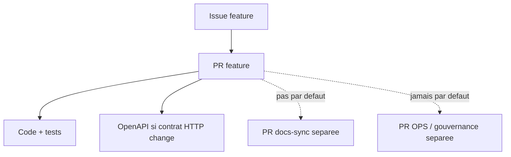

# Workflow PR Agentique

Ce document explique comment structurer les PRs creees par les agents IA.

Il doit etre lu avant de commencer une issue d'implementation.

Il doit etre mis a jour quand l'equipe change la facon de separer code, documentation et gouvernance.

## Objectif

Une PR doit rester facile a relire.

Les agents ne doivent pas transformer chaque PR feature en PR de synchronisation documentaire globale.



## PR Feature

Une PR feature doit contenir principalement:

- le code applicatif;
- les tests;
- les migrations si necessaire;
- `docs/openapi/openapi.yaml` si un endpoint, un payload, une reponse ou une erreur API publique change.

Une PR feature ne doit pas modifier par defaut:

- `AGENTS.md`;
- `docs/quality-gates.md`;
- `docs/docker-development.md`;
- `docs/backlog.md`;
- `docs/code-vs-spec.md`;
- `docs/traceability.md`;
- les scripts d'issues;
- les templates GitHub.

Si une PR feature touche plus d'un fichier Markdown, l'agent doit justifier pourquoi dans la PR.

## Contrats API

Pour l'API, OpenAPI devient la source de verite des contrats HTTP publics.

Le fichier attendu est:

```text
docs/openapi/openapi.yaml
```

Les anciennes docs manuelles de contrat ou de modele API ne doivent pas etre recréees si OpenAPI couvre le besoin.

## PR Docs-Sync

Une PR `docs-sync` sert a mettre a jour les documents de suivi apres une ou plusieurs PRs feature:

- `docs/code-vs-spec.md`;
- `docs/traceability.md`;
- `docs/backlog.md`;
- `chaye_documentations`.

Elle ne doit pas contenir de code applicatif.

## PR OPS / Gouvernance

Une PR `OPS` sert a modifier les regles de travail:

- `AGENTS.md`;
- quality gates;
- documentation Docker;
- scripts d'issues;
- templates GitHub;
- workflows CI;
- regles agentiques.

Elle ne doit pas contenir de feature produit.

## Regle Pour Les Agents IA

Avant de modifier un fichier Markdown, l'agent doit se demander:

1. Est-ce que ce fichier est indispensable pour comprendre ou tester cette PR ?
2. Est-ce que la modification peut attendre une PR `docs-sync` ?
3. Est-ce que la modification concerne plutot une PR `OPS` ?
4. Est-ce que `docs/openapi/openapi.yaml` est la bonne source de verite a modifier ?

Par defaut, reduire le bruit de PR prime sur la synchronisation exhaustive de toute la documentation.
