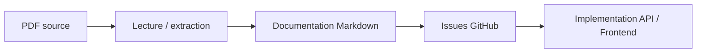

# Sources PDF

Ce dossier contient les documents PDF d'origine du projet Chaye.

Il sert a garder une trace des documents sources qui ont servi a construire la documentation Markdown du repo.

## Documents Repris

| Fichier | Role |
| --- | --- |
| `Chaye_CDC_V3.1_Final.pdf` | Cahier des charges fonctionnel principal |
| `Chaye_Brief_Technique.pdf` | Brief technique initial |
| `Chaye_Brief_Equipe_Juridique.pdf` | Brief juridique initial |
| `Chaye_BusinessPlan_MVP_Mecenat.pdf` | Business plan MVP et mecenat |

## Comment Utiliser Ces PDF

Les PDF sont des sources. Ils ne doivent pas rester le seul endroit ou une information importante existe.

Quand une regle produit, juridique ou technique utile est identifiee dans un PDF:

1. extraire l'information utile;
2. la reformuler en francais clair dans le dossier adapte;
3. garder les termes techniques exacts si necessaire;
4. ajouter un lien ou une reference vers le PDF source;
5. mettre a jour la tracabilite si cela cree ou modifie une exigence.

## Regle Importante

La documentation Markdown doit devenir la version exploitable par l'equipe et les agents IA.

Les PDF restent utiles pour l'historique, mais le travail quotidien doit pointer vers les fichiers Markdown de ce repo.
